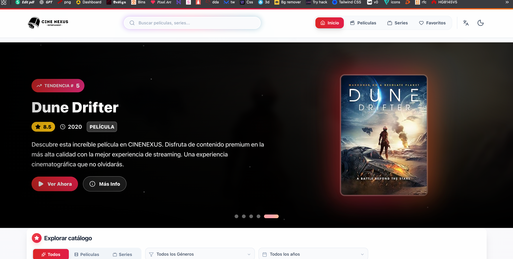
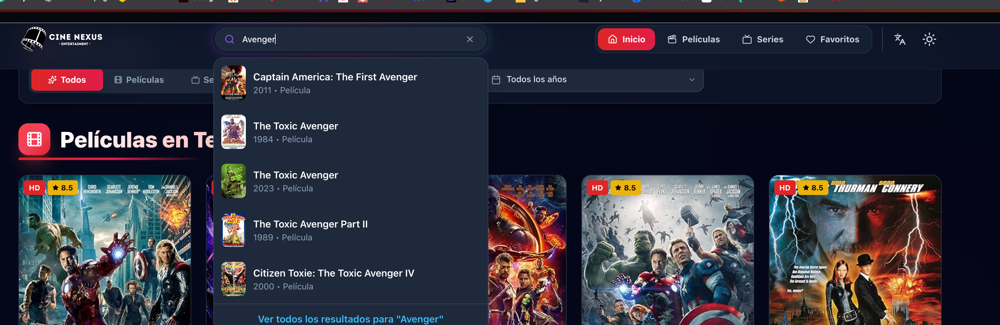
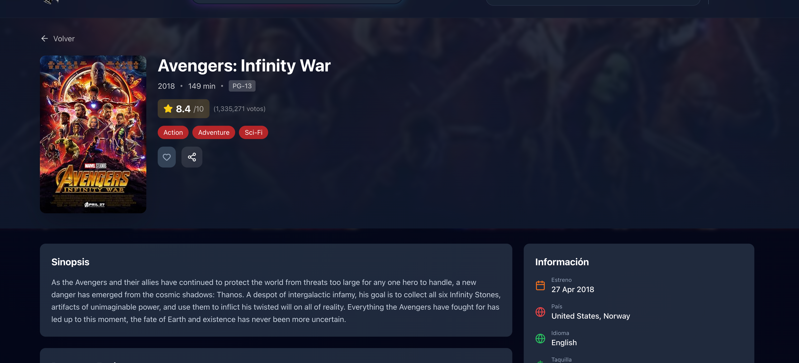
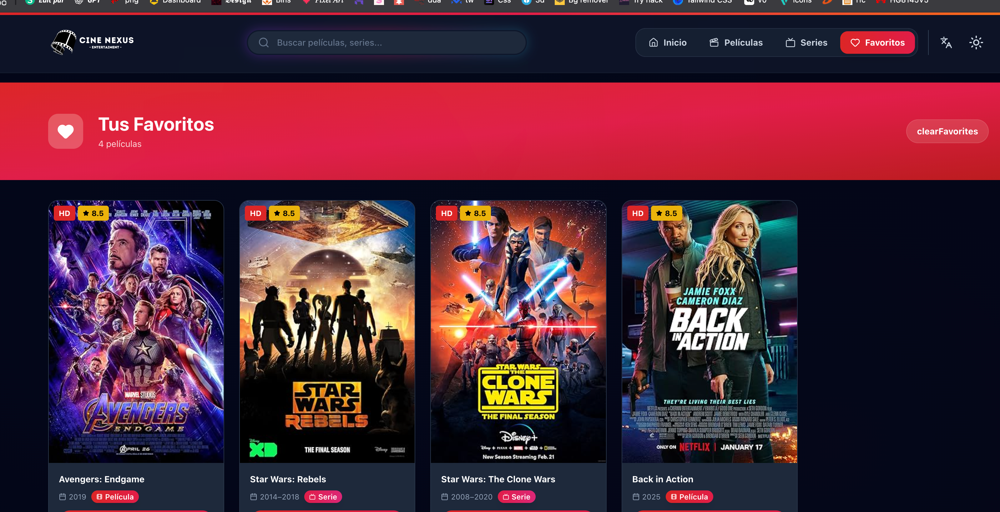
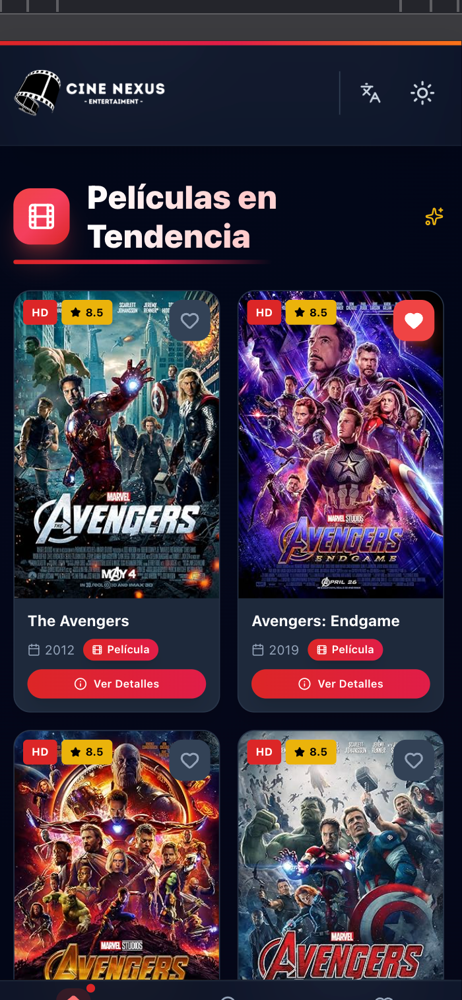

# Cine Nexus - Aplicación de Búsqueda de Películas y Series

Una aplicación moderna y visualmente atractiva para buscar películas y series, construida con React, TailwindCSS y la API de OMDb.

## 📋 Tabla de Contenidos

- [Características](#-características)
- [Tecnologías Utilizadas](#-tecnologías-utilizadas)
- [Requisitos Previos](#-requisitos-previos)
- [Instalación](#-instalación)
- [Configuración de la API](#-configuración-de-la-api)
- [Configuración de Variables de Entorno](#-configuración-de-variables-de-entorno)
- [Instalación de Librerías](#-instalación-de-librerías)
- [Ejecución del Proyecto](#-ejecución-del-proyecto)
- [Estructura del Proyecto](#-estructura-del-proyecto)
- [Scripts Disponibles](#-scripts-disponibles)
- [Poner Imágenes y Demás](#-poner-imágenes-y-demás)

## ✨ Características

- **Interfaz Premium**: Diseño inspirado en Netflix/Disney+, con modo oscuro, glassmorphism y animaciones fluidas
- **Búsqueda Inteligente**: Búsqueda en tiempo real con debounce, caché y filtros avanzados (Tipo, Año)
- **Diseño Responsive**: Enfoque mobile-first con barra de navegación inferior para dispositivos móviles
- **Sistema de Favoritos**: Guarda tus películas favoritas localmente
- **Rendimiento Optimizado**: Optimizado con caché en localStorage para minimizar llamadas a la API y carga diferida de imágenes
- **Elementos Interactivos**: Efectos 3D al pasar el mouse, headers con parallax y transiciones suaves entre páginas
- **Tema Claro/Oscuro**: Cambio de tema con persistencia en localStorage y sombras mejoradas en modo claro
- **Detalles Completos**: Página de detalles con información completa de cada película o serie, bien estructurada e indentada
- **Reproductor de Tráilers**: Reproduce tráilers de YouTube directamente en la página (requiere API key opcional)
- **Multiidioma**: Soporte para español e inglés con cambio de idioma en tiempo real
- **Tarjetas Mejoradas**: Tarjetas de películas con efectos 3D mejorados, más inclinadas y con mejor diseño

## 🛠️ Tecnologías Utilizadas

- **Framework**: React 19 + Vite 7
- **Estilos**: TailwindCSS v3 + Animaciones CSS personalizadas
- **Iconos**: Lucide React
- **Enrutamiento**: React Router DOM v7
- **Gestión de Estado**: React Context API (Theme, Favorites, Language)
- **Animaciones**: Motion (Framer Motion)
- **API**: OMDb API
- **Utilidades**: clsx, tailwind-merge

## 📦 Requisitos Previos

Antes de comenzar, asegúrate de tener instalado:

- **Node.js** (versión 18 o superior)
- **npm** (viene incluido con Node.js) o **yarn**
- Una cuenta en [OMDb API](http://www.omdbapi.com/apikey.aspx) para obtener tu clave de API

## 🚀 Instalación

### 1. Clonar el Repositorio

```bash
git clone <url-del-repositorio>
cd movie-search-app
```

### 2. Instalar Dependencias

```bash
npm install
```

### O si prefieres usar yarn:

```bash
yarn install
```

## 🔑 Configuración de la API

### Obtener Clave de API de OMDb

1. Visita [OMDb API](http://www.omdbapi.com/apikey.aspx)
2. Selecciona el tipo de plan que necesitas:
   - **Plan Gratuito**: 1,000 solicitudes por día
   - **Plan Pagado**: Solicitudes ilimitadas
3. Completa el formulario con tu información
4. Verifica tu correo electrónico
5. Copia tu clave de API (tendrá un formato como: `abc12345`)

### Información sobre la API

- **URL Base**: `https://www.omdbapi.com/`
- **Límite de solicitudes**: Depende de tu plan
- **Documentación**: [OMDb API Documentation](https://www.omdbapi.com/)

## ⚙️ Configuración de Variables de Entorno

### Crear Archivo .env

En la raíz del proyecto, crea un archivo llamado `.env`:

```bash
touch .env
```

### O en Windows:

```bash
type nul > .env
```

### Configurar Variables

Abre el archivo `.env` y agrega la siguiente configuración:

```bash
.env
VITE_OMDB_API_KEY=tu_clave_de_api_aqui
```

**Ejemplo:**

```bash
.env
VITE_OMDB_API_KEY=abc12345
```

### Importante sobre Variables de Entorno en Vite

- Las variables de entorno en Vite deben comenzar con `VITE_` para ser accesibles en el código del cliente
- No incluyas espacios alrededor del signo `=`
- No uses comillas a menos que sean parte del valor
- **NUNCA** subas el archivo `.env` a un repositorio público. Asegúrate de que esté en tu `.gitignore`

### Verificar .gitignore

Asegúrate de que tu archivo `.gitignore` incluya:

```
.env
.env.local
.env.production
```

## 📚 Instalación de Librerías

El proyecto utiliza las siguientes dependencias principales:

### Dependencias de Producción

```bash
npm install react react-dom react-router-dom
npm install motion
npm install lucide-react
npm install clsx tailwind-merge
npm install @radix-ui/react-hover-card
npm install qss
```

### Dependencias de Desarrollo

```bash
npm install -D vite @vitejs/plugin-react
npm install -D tailwindcss postcss autoprefixer
npm install -D eslint
npm install -D @types/react @types/react-dom
```

### Instalación Completa

Todas las dependencias se instalan automáticamente cuando ejecutas:

```bash
npm install
```

## 🏃 Ejecución del Proyecto

### Modo Desarrollo

Para ejecutar el proyecto en modo desarrollo:

```bash
npm run dev
```

El servidor de desarrollo se iniciará en `http://localhost:5173` (o el puerto que Vite asigne automáticamente).

### Modo Producción

Para crear una versión optimizada para producción:

```bash
npm run build
```

Los archivos compilados se generarán en la carpeta `dist/`.

### Vista Previa de Producción

Para previsualizar la versión de producción localmente:

```bash
npm run preview
```

### Linting

Para verificar el código con ESLint:

```bash
npm run lint
```

## 📂 Estructura del Proyecto

```
movie-search-app/
├── public/                 # Archivos estáticos
│   └── vite.svg
├── src/
│   ├── assets/            # Recursos estáticos (imágenes, etc.)
│   ├── components/        # Componentes reutilizables
│   │   ├── ui/           # Componentes de UI (BackgroundBeams, Spotlight, etc.)
│   │   ├── DarkModeToggle.jsx
│   │   ├── FavoriteButton.jsx
│   │   ├── Filters.jsx
│   │   ├── Footer.jsx
│   │   ├── MovieCard.jsx
│   │   ├── MovieCardSkeleton.jsx
│   │   ├── MovieList.jsx
│   │   ├── Navbar.jsx
│   │   ├── Pagination.jsx
│   │   ├── ParallaxHeader.jsx
│   │   ├── SearchBar.jsx
│   │   ├── TabsResponsive.jsx
│   │   └── ToggleTheme.jsx
│   ├── context/          # Contextos de React (Theme, Favorites, Language)
│   │   ├── FavoritesContext.jsx
│   │   ├── LanguageContext.jsx
│   │   └── ThemeContext.jsx
│   ├── hooks/            # Hooks personalizados
│   │   ├── useDebounce.js
│   │   ├── useFetchMovies.js
│   │   └── useLocalStorage.js
│   ├── lib/              # Utilidades de librerías
│   │   └── utils.js
│   ├── pages/            # Componentes de páginas/rutas
│   │   ├── Favorites.jsx
│   │   ├── Home.jsx
│   │   ├── MovieDetail.jsx
│   │   ├── NotFound.jsx
│   │   └── SearchResults.jsx
│   ├── styles/           # Estilos globales
│   │   └── globals.css
│   ├── utils/            # Funciones auxiliares
│   │   ├── api.js        # Configuración y funciones de la API
│   │   └── formatters.js
│   ├── App.jsx           # Componente principal de la aplicación
│   └── main.jsx          # Punto de entrada
├── .env                  # Variables de entorno (NO subir a git)
├── .gitignore
├── eslint.config.js
├── index.html
├── package.json
├── postcss.config.js
├── tailwind.config.js
├── vite.config.js
└── README.md
```

## 📜 Scripts Disponibles

En el archivo `package.json` encontrarás los siguientes scripts:

- `npm run dev`: Inicia el servidor de desarrollo
- `npm run build`: Construye la aplicación para producción
- `npm run preview`: Previsualiza la versión de producción
- `npm run lint`: Ejecuta ESLint para verificar el código

## 📸 Poner Imágenes y Demás

En esta sección puedes agregar capturas de pantalla de tu aplicación para mostrar cómo se ve:

### Capturas de Pantalla Sugeridas

1. **Página de Inicio (Home)**
   - Muestra el hero section con el título y los posters destacados
   - Incluye las secciones de "Películas en Tendencia" y "Series Populares"
   

2. **Página de Búsqueda (Search Results)**
   - Muestra los resultados de búsqueda con los filtros aplicados
   - Incluye la paginación en funcionamiento
   

3. **Página de Detalles (Movie Detail)**
   - Muestra la información completa de una película
   - Incluye el poster, sinopsis, reparto, calificaciones, etc.
   

4. **Página de Favoritos**
   - Muestra la lista de películas favoritas guardadas
   

5. **Vista Móvil**
   - Capturas de cómo se ve la aplicación en dispositivos móviles
   - Muestra la barra de navegación inferior
   

## 📝 Notas Adicionales

- La API de OMDb tiene límites según tu plan. El plan gratuito permite 1,000 solicitudes por día
- Los favoritos se guardan en localStorage del navegador
- El tema (claro/oscuro) también se guarda en localStorage
- Las imágenes se cargan de forma diferida (lazy loading) para mejorar el rendimiento

## 📄 Licencia

Este proyecto es de código abierto y está disponible bajo la licencia MIT.

## 👨‍💻 Autor

Desarrollado por Yair hernandez para la búsqueda de películas y series.

---

**¡Disfruta explorando películas y series con Cine Nexus!** 🎬
